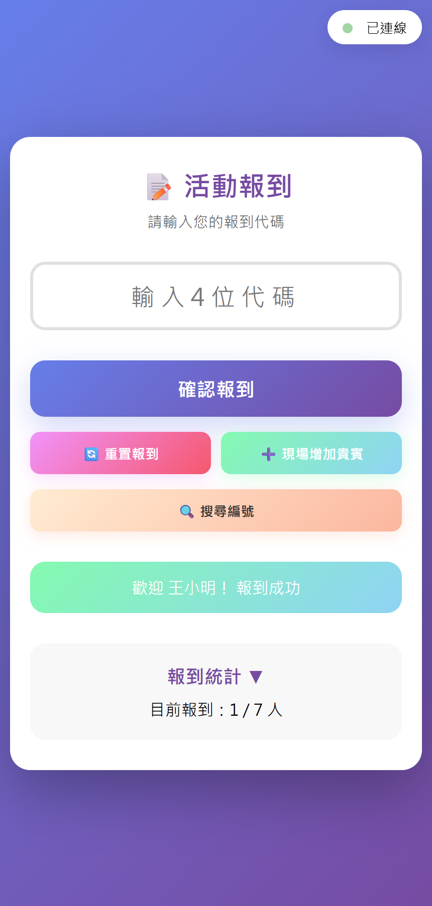
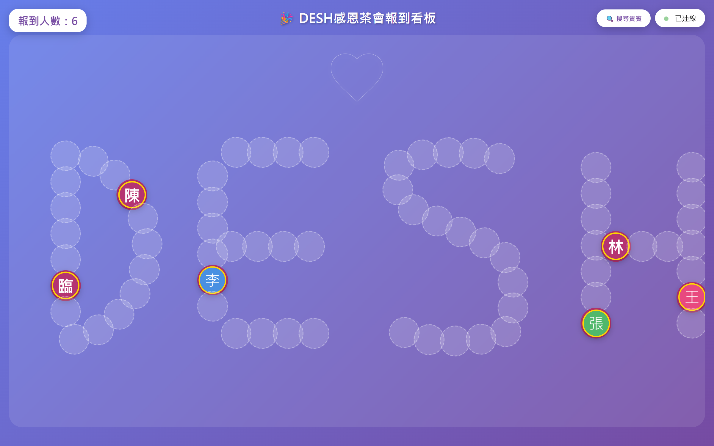
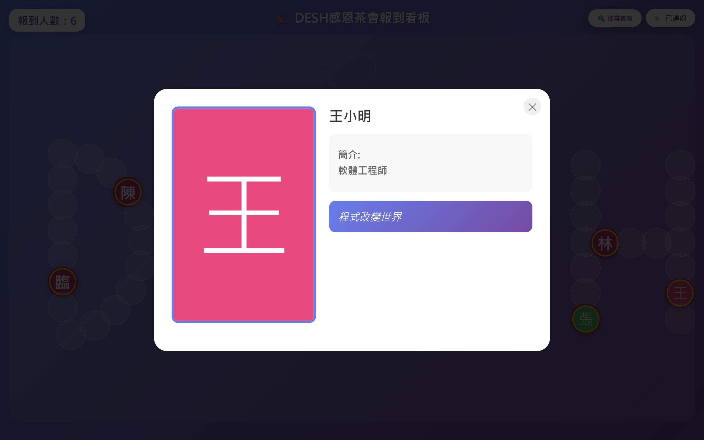

# 活動報到系統 / Event Check-in System

### 🔗 線上互動 Demo / Live Demo

**👉 https://teacher-pika.github.io/event-checkin-wall/demo/**

點進去後按左上角「**一鍵報到全部（測試用）**」看頭像動畫上牆、或按「**🚀 模擬 200 人壓力測試**」看大量報到的自動排版，點任一頭像可看詳細資料。（純前端展示，範例資料，無真實個資）

Open the page and click **"一鍵報到全部 (測試用)"** to watch avatars animate onto the wall, or **"🚀 模擬 200 人壓力測試"** to see the layout fill with ~200 people; click any avatar for details. (Front-end only, sample data, no real personal data.)

[](https://github.com/teacher-pika/event-checkin-wall/actions/workflows/demo.yml)

> 一個輕量、即時、易於部署的活動報到系統。
> A lightweight, real-time, easy-to-deploy event check-in system.

**語言 / Language：[繁體中文](#中文說明) ｜ [English](#english)**

---

<a id="中文說明"></a>

# 中文說明

## 目錄

- [簡介](#簡介)
- [主要功能](#主要功能)
- [畫面截圖](#畫面截圖)
- [系統組成](#系統組成)
- [快速開始](#快速開始)
- [參與者資料格式](#參與者資料格式)
- [照片與色塊頭像](#照片與色塊頭像)
- [設定檔](#設定檔)
- [個資與隱私](#個資與隱私)
- [技術棧](#技術棧)
- [授權](#授權)

<a id="簡介"></a>

## 簡介

這是一個專為小型會議、工作坊或課程設計的活動報到系統。它提供一個簡單的報到介面，以及一個動態的即時呈現畫面，增加活動的互動性。基於 Node.js，無需資料庫即可部署。

<a id="主要功能"></a>

## 主要功能

- **即時報到**：參與者使用專屬代碼報到，結果即時反應。
- **動態呈現**：在大螢幕即時顯示已報到者頭像，並有歡迎動畫。
- **資料持久化**：伺服器重啟後，已報到資料不會遺失。
- **CSV 資料源**：透過編輯 `data.csv` 管理參與者名單。
- **色塊頭像備援**：沒有照片時自動顯示色塊＋姓名，無須準備所有照片。
- **每日報表**：自動產生每日報到 CSV 報表。
- **簡易部署**：純 Node.js，無需資料庫。

<a id="畫面截圖"></a>

## 畫面截圖

> 以下截圖皆使用 `data.sample.csv` 範例資料，未包含任何真實個資。

### 報到端（手機）

參與者輸入 4 位代碼即可報到，即時顯示成功訊息與報到統計。



### 呈現端：即時報到牆

已報到者的頭像會即時出現在大螢幕上，沿著活動主題字樣排列（沒有照片者顯示色塊頭像）。



### 呈現端：點開人物

點擊任一頭像，會彈出該參與者的大照片、簡介與金句。



<a id="系統組成"></a>

## 系統組成

| 檔案 / 資料夾 | 說明 |
|---|---|
| `server.js` | 核心後端，使用 Node.js、Express、Socket.io |
| `public/checkin.html` | 參與者輸入代碼的報到頁面 |
| `public/display.html` | 大螢幕展示的即時報到牆 |
| `config.js` | 前端顯示與測試相關設定 |
| `data.csv` | 參與者名單（**真實資料不上 git**，請參考 `data.sample.csv`） |
| `photo/` | 參與者照片資料夾（**真實照片不上 git**，僅含示範色塊樣張） |
| `tool/update_data.py` | 批次合併新名單到 `data.csv` 的工具（見 `tool/README.md`） |

> 📌 真實名單、照片、報到紀錄等個資皆**不會上傳到 git**，詳見 [個資與隱私](#個資與隱私)。

<a id="快速開始"></a>

## 快速開始

### 1. 環境準備

請先安裝 [Node.js](https://nodejs.org/)（建議 LTS 版本）。

### 2. 安裝依賴

```bash
npm install
```

### 3. 準備參與者資料

複製範例檔為正式檔，再填入你的名單：

```bash
cp data.sample.csv data.csv
```

> 若直接啟動而沒有 `data.csv`，系統會自動產生一份內含範例資料的 `data.csv` 與 `photo/` 資料夾。

### 4. 啟動伺服器

```bash
node server.js
```

看到以下訊息表示啟動成功：

```
🚀 報到系統伺服器啟動成功！
📍 伺服器位址: http://localhost:3000
```

### 5. 開啟頁面

- **報到端**：`http://<YOUR_SERVER_IP>:3000/checkin.html`
- **呈現端**：`http://<YOUR_SERVER_IP>:3000/display.html`

> 使用 `ipconfig`（Windows）或 `ifconfig`（Mac/Linux）查看本機區域網路 IP。

<a id="參與者資料格式"></a>

## 參與者資料格式

`data.csv` 欄位如下（範例見 [`data.sample.csv`](data.sample.csv)）：

```csv
id,name,code,intro,quote,photo,checkedIn
0901,王小明,0901,軟體工程師,程式改變世界,,false
```

| 欄位 | 必填 | 說明 |
|---|---|---|
| `id` | ✅ | 唯一識別碼（4 位數字，如 0901） |
| `name` | ✅ | 姓名 |
| `code` | ✅ | 報到代碼 |
| `intro` | ⭕ | 個人簡介（可留空，支援 `\n` 換行） |
| `quote` | ⭕ | 座右銘或金句（可留空） |
| `photo` | ⭕ | 照片路徑（多數情況留空，見下） |
| `checkedIn` | ✅ | 初始報到狀態，設為 `false` |

<a id="照片與色塊頭像"></a>

## 照片與色塊頭像

`photo` 欄位 **多數情況請留空**，系統會自動依 `id` 尋找照片：

| 情境 | `photo` 欄位 | 系統行為 |
|---|---|---|
| 標準照片 | 留空 | 自動使用 `photo/{id}.jpg`（或 `.png/.jpeg/.gif`） |
| 沒有照片 | 留空 | 顯示**色塊頭像**＋姓名 |
| 外部連結 | 完整 URL | 從網址載入照片 |
| 自定義檔名 | 檔名 | 使用 `photo/檔名` |

- 小頭像：`{id}.jpg`；大照片（彈窗用）：`big{id}.jpg`。
- 本倉庫僅內含 `0901`–`0903` 的**示範色塊樣張**；其餘真實照片不上 git。

<a id="設定檔"></a>

## 設定檔

`config.js` 控制前端的除錯與顯示行為，例如：

| 設定 | 說明 |
|---|---|
| `showTestCheckinButton` | 是否顯示「一鍵報到全部（測試用）」按鈕 |
| `showTotalCount` | 報到統計是否顯示總人數（`1 / 10` 或 `1`） |
| `useMockUserCount` | 壓力測試用：自動補齊假資料至指定人數 |

<a id="個資與隱私"></a>

## 個資與隱私

本專案已為公開上 git 做好個資隔離：

- **不上 git 的內容**（由 `.gitignore` 排除）：真實 `data.csv`、`checkedin.json`、`checkin_report_*.csv`、`backup/`、`new_data.txt`、各式日誌、`photo/` 內的真實照片，以及 `doc/` 整個資料夾。
- **git 只提供範例**：`data.sample.csv`、`new_data.sample.txt`，以及 `photo/` 內的色塊樣張。
- **`doc/`**：集中存放內部說明文檔與所有真實個資的封存副本，**整個資料夾不上 git**。
- 真實檔案仍保留在本機，系統可正常執行；git 端只看得到範例。

> ⚠️ 加入新照片或名單前，請確認它們符合 `.gitignore` 規則，避免個資外洩。

<a id="技術棧"></a>

## 技術棧

- **後端**：Node.js、Express.js
- **即時通訊**：Socket.io
- **前端**：Vanilla JavaScript、HTML5、CSS3
- **資料處理**：csv-parser

<a id="授權"></a>

## 授權

本專案採用 **MIT** 授權，詳見 [LICENSE](LICENSE)。

---

<a id="english"></a>

# English

## Table of Contents

- [Introduction](#introduction)
- [Features](#features)
- [Screenshots](#screenshots)
- [Project Structure](#project-structure)
- [Quick Start](#quick-start)
- [Participant Data Format](#participant-data-format)
- [Photos & Color-block Avatars](#photos--color-block-avatars)
- [Configuration](#configuration)
- [Privacy & Personal Data](#privacy--personal-data)
- [Tech Stack](#tech-stack)
- [License](#license)

<a id="introduction"></a>

## Introduction

A check-in system designed for small conferences, workshops, and courses. It offers a simple check-in page and a dynamic real-time display wall to make events more interactive. Built on Node.js — no database required.

<a id="features"></a>

## Features

- **Real-time check-in** — participants check in with a personal code; results update instantly.
- **Dynamic display** — checked-in avatars appear live on a big screen with a welcome animation.
- **Persistence** — checked-in data survives server restarts.
- **CSV-driven** — manage the participant list by editing `data.csv`.
- **Color-block fallback** — missing photos render as a colored block + name, so you don't need every photo.
- **Daily reports** — a daily check-in CSV report is generated automatically.
- **Simple deployment** — pure Node.js, no database.

<a id="screenshots"></a>

## Screenshots

> All screenshots use the sample data in `data.sample.csv` — no real personal data is shown.

### Check-in page (mobile)

Participants enter a 4-digit code to check in; a success message and live stats appear instantly.


### Display: live check-in wall

Checked-in avatars pop onto the big screen in real time, arranged along the event's title lettering (people without a photo get a color-block avatar).


### Display: person detail

Click any avatar to open that participant's large photo, bio, and quote.


<a id="project-structure"></a>

## Project Structure

| File / Folder | Description |
|---|---|
| `server.js` | Core backend (Node.js, Express, Socket.io) |
| `public/checkin.html` | Check-in page for participants |
| `public/display.html` | Real-time display wall for the big screen |
| `config.js` | Front-end display & testing settings |
| `data.csv` | Participant list (**real data is git-ignored**; see `data.sample.csv`) |
| `photo/` | Participant photos (**real photos are git-ignored**; sample blocks only) |
| `tool/update_data.py` | Tool to merge new entries into `data.csv` (see `tool/README.md`) |

> 📌 Real lists, photos, and check-in records are **never committed to git** — see [Privacy & Personal Data](#privacy--personal-data).

<a id="quick-start"></a>

## Quick Start

### 1. Prerequisites

Install [Node.js](https://nodejs.org/) (LTS recommended).

### 2. Install dependencies

```bash
npm install
```

### 3. Prepare participant data

Copy the sample file and fill in your own list:

```bash
cp data.sample.csv data.csv
```

> If you start without a `data.csv`, the system auto-generates one with sample data plus a `photo/` folder.

### 4. Start the server

```bash
node server.js
```

Success looks like:

```
🚀 報到系統伺服器啟動成功！
📍 伺服器位址: http://localhost:3000
```

### 5. Open the pages

- **Check-in**: `http://<YOUR_SERVER_IP>:3000/checkin.html`
- **Display**: `http://<YOUR_SERVER_IP>:3000/display.html`

> Use `ipconfig` (Windows) or `ifconfig` (Mac/Linux) to find your LAN IP.

<a id="participant-data-format"></a>

## Participant Data Format

`data.csv` columns (see [`data.sample.csv`](data.sample.csv)):

```csv
id,name,code,intro,quote,photo,checkedIn
0901,王小明,0901,Software Engineer,Code changes the world,,false
```

| Column | Required | Description |
|---|---|---|
| `id` | ✅ | Unique ID (4 digits, e.g. 0901) |
| `name` | ✅ | Name |
| `code` | ✅ | Check-in code |
| `intro` | ⭕ | Bio (optional; supports `\n` line breaks) |
| `quote` | ⭕ | Motto or quote (optional) |
| `photo` | ⭕ | Photo path (usually empty; see below) |
| `checkedIn` | ✅ | Initial state, set to `false` |

<a id="photos--color-block-avatars"></a>

## Photos & Color-block Avatars

Leave the `photo` column **empty in most cases** — the system finds photos by `id`:

| Case | `photo` value | Behavior |
|---|---|---|
| Standard photo | empty | Uses `photo/{id}.jpg` (or `.png/.jpeg/.gif`) |
| No photo | empty | Renders a **color-block avatar** + name |
| External link | full URL | Loads from the URL |
| Custom filename | filename | Uses `photo/<filename>` |

- Small avatar: `{id}.jpg`; large photo (modal): `big{id}.jpg`.
- This repo ships only **sample color-block avatars** for `0901`–`0903`; real photos are git-ignored.

<a id="configuration"></a>

## Configuration

`config.js` controls front-end debug & display behavior, e.g.:

| Setting | Description |
|---|---|
| `showTestCheckinButton` | Show the "check in everyone (test)" button |
| `showTotalCount` | Show total count in stats (`1 / 10` vs `1`) |
| `useMockUserCount` | Stress test: pad with mock users up to N |

<a id="privacy--personal-data"></a>

## Privacy & Personal Data

This project is set up so it can be published to git without leaking personal data:

- **Never committed** (excluded by `.gitignore`): real `data.csv`, `checkedin.json`, `checkin_report_*.csv`, `backup/`, `new_data.txt`, logs, real photos under `photo/`, and the entire `doc/` folder.
- **Git ships only samples**: `data.sample.csv`, `new_data.sample.txt`, and the color-block sample avatars in `photo/`.
- **`doc/`**: holds internal guides and an archived copy of all real personal data — the whole folder is git-ignored.
- Real files stay on your machine so the app keeps running; git only ever sees the samples.

> ⚠️ Before adding new photos or lists, make sure they match the `.gitignore` rules to avoid leaking personal data.

<a id="tech-stack"></a>

## Tech Stack

- **Backend**: Node.js, Express.js
- **Real-time**: Socket.io
- **Frontend**: Vanilla JavaScript, HTML5, CSS3
- **Data**: csv-parser

<a id="license"></a>

## License

Released under the **MIT** License — see [LICENSE](LICENSE).
